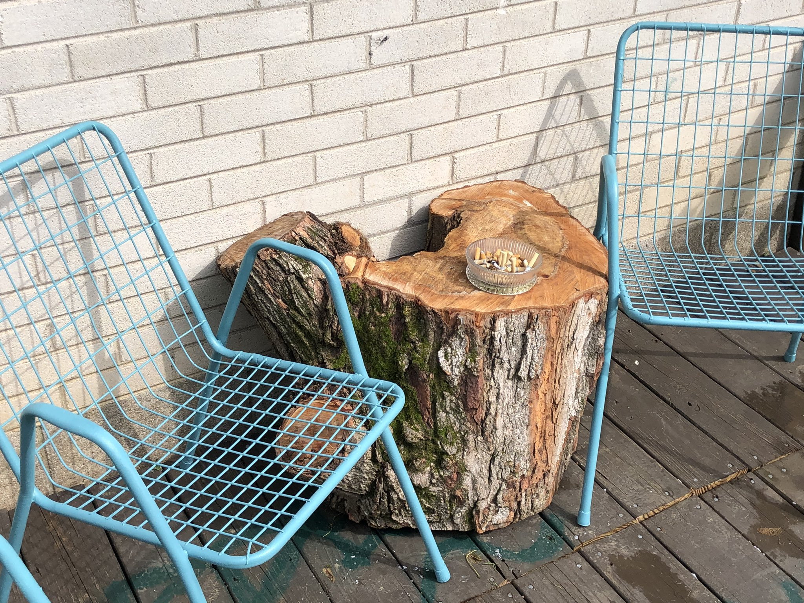

## a quick summary of what I learned in ECE 171A

Control systems, as the name suggest, is the study of controlling systems. Physical systems such as driving a motor, flying a plane, or working an industrial plant require control systems to ensure that they are working as they should.  
There are multiple ways of designing control systems. The different tools and techniques depend on the specific problem to be solved. 
The most basic ones help to visualize and understand the underlying principles behind control systems.
Root locus, bode plot, transfer functions, 
The more complex 

