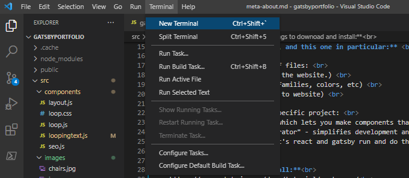
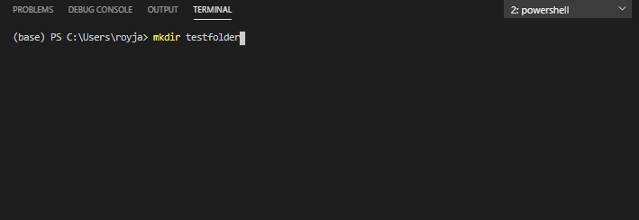
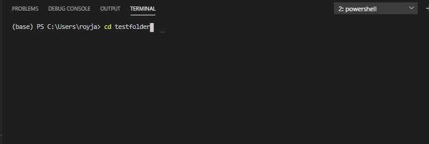
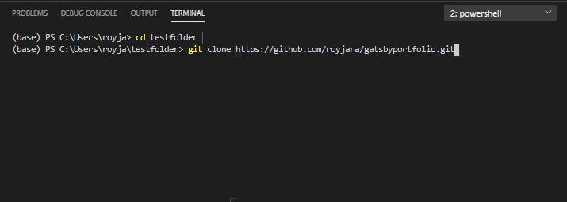

 

Hi Jerry,

Sorry for taking longer than what I initially said.

These are the instructions to get this site up and running:

**0. Brief overview of websites, and this one in particular:**  

They're made with three types of files:  
-- HTML (barebones structure of the website.)  
-- CSS ("Styles". Defines font families, colors, etc)  
-- JS (adds extra functionality to website)  

Stack of technologies in this specific project:  
-- React ("frontend" framework which lets you make components that combine js with html and css)  
-- Gatsby.js ("static site generator" - simplifies development and publishing of react projects)  
-- Node (Backend technology, allows react and gatsby to run and do their thing)

**1. Things to downoad and install:** 
-- download node (version doesnt matter) and git. follow these instructions https://www.gatsbyjs.com/docs/tutorial/part-zero/ 
-- download vs code https://code.visualstudio.com/ (where you will code/edit code) 

**2. Copy example project from github** 
-- Open vscode  
-- open a terminal console  
</img>
-- enter > mkdir "name of a folder where you want to copy project files" 
*note: mkdir is short for make directory*
</img>
-- enter > cd testfolder  
*note: cd is short for change directory*  
</img>
-- enter > git clone https://github.com/royjara/gatsbyportfolio.git  
*- if this doesnt work, try using bash instead of powershell: https://stackoverflow.com/questions/42606837/how-do-i-use-bash-on-windows-from-the-visual-studio-code-integrated-terminal*
</img>

**3. Use node to install every other thing that's needed to run project** 
-- enter > cd gatsbyportfolio  
-- once inside the project directory, run > npm install  
-- install gatsby-cli (command line interface) by running > npm install -g gatsby-cli  

**4. Start development server** 
-- if above commands worked, enter > gatsby develop 
-- This will launch your own website in http://localhost:8000 where you can see the changes you make 
-- when you want to stop the server just input ctrl+c in the terminal

**5. Publishing the website with surge** 
-- Detailed instructions: https://www.gatsbyjs.com/docs/deploying-to-surge/  

---

### Writing posts ###

After succeessfully running the development server, building the website, and publishing it with surge, try making your own posts.

Gatsby is running a website generator that converts markdown files into web pages.  
All you have to do is create a new markdown file in ./src/pages/  
e.g. this page ./src/pages/installation.md is a markdown file that was converted into a webpage  

 

---
## Some notes ##

There are some bugs but for now I think it works ok for its purpose. 

The current main bug is that you need to include a featured image for every markdown page.  

I will continue working on the template and later with git you will be able to get my updates. I will try to remove any hardcoded data in the template, so that in the future you can just get the updates without worrying about any data or style that might get overwritten.  

Please send me your suggestions for any extra features you want. Also, share any bugs with me so that I can fix them.

lmk if you have any questions or need any help.

cheers,

Roy

