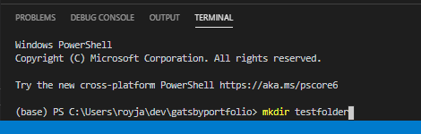

## The motivation behind this website 

Hi Jerry,

Sorry for taking longer than what I initially said.

These are the instructions to get this site up and running:

**0. Brief overview of websites, and this one in particular:**  

They're made with three types of files:  
-- HTML (barebones structure of the website.)  
-- CSS ("Styles". Defines font families, colors, etc)  
-- JS (adds extra functionality to website)  

Stack of technologies in this specific project:  
-- React ("frontend" framework which lets you make components that combine js with html and css)  
-- Gatsby.js ("static site generator" - simplifies development and publishing of react projects)  
-- Node (Backend technology, let's react and gatsby run and do their thing)

**1. Things to downoad and install:** 
-- https://www.gatsbyjs.com/docs/tutorial/part-zero/ 
-- vs code https://code.visualstudio.com/ (where you will code/edit code) 
-- 

**2. Copy example project from github** 
-- Open vscode  
-- open a terminal console  
</img>
-- enter > mkdir "name of a folder where you want to copy project files" 
*mkdir is short for make directory*
</img>
-- enter > cd testfolder
*cd is short for change directory*
-- enter > git clone https://github.com/royjara/gatsbyportfolio.git  

**3. Use node to install every other thing that's needed to run project** 
-- enter > cd gatsbyportfolio  
-- once inside the project directory, you run > npm install  
*npm stands for node package manager. react, gatsby and all these extra things are node packages.*  
-- install gatsby-cli (command line interface) by running > npm install -g gatsby-cli  
*the "-" indicates this is an optional argument for the npm install command*  
*-g is global, so that gatsby-cli is installed in the entire computer, not just within this folder*  

## cheers

Also fyi i got into UCLA! for the masters.
still waiting on other schools to reply, but i'm definitely excited about this option.

